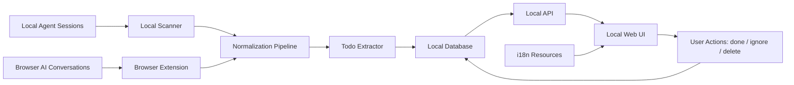

# Architecture

AI Todo is a local-first tool that extracts actionable todos — with evidence —
from your AI coding sessions (local agent logs) and browser AI conversations,
and shows them in a local web UI. Everything runs on your machine.

It is built on **iii-engine**'s three primitives — Worker, Function, Trigger.
All state and logic flow through `registerFunction` / `registerTrigger` /
`sdk.trigger()`; the system never bypasses iii-engine with a standalone store.

- **Engine:** iii-sdk (WebSocket to iii-engine)
- **State:** file-based SQLite via iii-engine's StateModule (`./data/state_store.db`)
- **Build:** TypeScript → ESM via tsdown (output to `dist/`)
- **Surfaces:** local REST API + MCP server + local web UI

## Overview

## Components

| Component | Responsibility |
|---|---|
| Local scanner | Read supported local agent logs and sessions |
| Browser extension | Capture visible browser AI conversation content and source metadata |
| Normalization pipeline | Convert different sources into a common session format |
| Todo extractor | Generate candidate todos with status, summary, and evidence |
| Local database | Persist todos, evidence, scan state, and user actions |
| Local API | Serve todo data to the UI and accept status updates |
| Web UI | View, filter, complete, ignore, delete, and inspect evidence |
| i18n resources | Provide UI strings without changing business logic |

## Data model

| Entity | Required fields |
|---|---|
| `sources` | `id`, `type`, `name`, `path_or_url`, `enabled`, `last_scanned_at` |
| `sessions` | `id`, `source_id`, `external_id`, `started_at`, `updated_at`, `raw_ref`, `hash` |
| `todos` | `id`, `session_id`, `title`, `summary`, `status`, `confidence`, `state`, `created_at`, `updated_at` |
| `evidence` | `id`, `todo_id`, `kind`, `text`, `path`, `url`, `timestamp` |
| `scan_checkpoints` | `source_id`, `cursor`, `last_success_at`, `last_error` |

Todo `state` values: `active`, `done`, `ignored`, `deleted`. Display labels are
kept separate from these stored values (see [RULES.md](RULES.md)).

## Code map

Where each component lives today, and what is built vs. in progress:

| Component | Code | Status |
|---|---|---|
| Local scanner | `src/replay/`, `src/functions/replay.ts` (manual import today) | automatic per-source scanner in progress |
| Browser extension | `browser-extension/` → `src/viewer/server.ts` (capture intake) | built (evidence intake) |
| Normalization | `src/replay/jsonl-parser.ts` | built |
| Todo extractor | `src/functions/action-candidates.ts` (rule-based) | built; LLM classifier deferred to v1.1 |
| Local database | iii-engine StateModule; KV scopes in `src/state/schema.ts` | built |
| Local API | `src/triggers/api.ts` (REST), `src/mcp/` (MCP) | built |
| Web UI | `src/viewer/index.html` | built |
| i18n | `src/viewer/` (inline `{en, zh}` base + `t()`) | base built |

## Boundaries & design principles

- All persistence goes through iii-engine's StateModule — no standalone SQLite or in-process store.
- Stored enum values are stable; UI display strings live in i18n resources, keyed by the stored value, separate from logic.
- Validate inputs at system boundaries (MCP handlers, REST endpoints); REST endpoints whitelist fields — never forward a raw request body to `sdk.trigger()`.
- Keep side effects near the boundary; prefer explicit data flow; avoid adding abstractions before a pattern repeats.
- See [AGENTS.md](AGENTS.md) for code patterns, the per-change consistency checklists, and the definition of done.

## Data flow

1. The local scanner reads supported agent logs; the browser extension captures browser AI conversations.
2. Sources are normalized into a common session format.
3. The todo extractor produces candidate todos with status, summary, and evidence.
4. Todos and evidence persist in the local database.
5. The local API serves todos to the web UI and accepts status updates.
6. The user marks todos done / ignored / deleted; updates flow back to the database.
