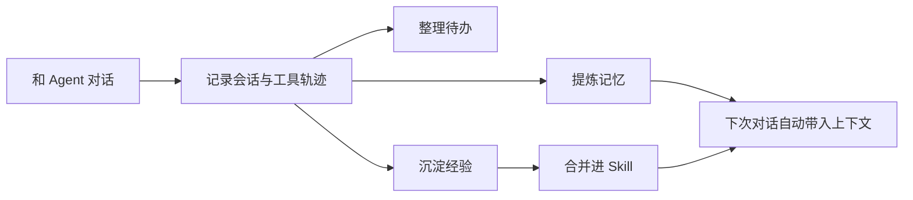

<p align="center">
  
</p>

# Agentmemory

**给 Coding Agent 用的本地记忆工作台。**

Agentmemory 会把你和 Agent 的会话、工具调用、项目线索、偏好、经验、待办和 Skill 组织成一个可审阅的本地记忆库。它不是又一个聊天记录列表，而是让 Agent 真的知道：你是谁、项目做到哪、哪些经验值得复用、下一步该跟进什么。

<p align="center">
  
</p>

## 你能用它做什么

| 场景 | Agentmemory 做的事 |
| --- | --- |
| 不想每次重复解释项目背景 | 自动保存项目会话、文件夹、关键线索 |
| 想让 Agent 记住你的偏好 | 把稳定偏好沉淀进记忆库，支持审阅和编辑 |
| 想复盘最近工作 | 按项目查看最近会话和完整过程 |
| 想整理可复用经验 | 把会话里的做法沉淀成经验，再合并进 Skill |
| 想管理本地 Skill | 扫描本机 Skill，查看来源、路径、说明和内容预览 |
| 想知道下一步该做什么 | 从会话里整理待办、卡住事项和已完成事项 |

## 主要界面

### 总览：从工作地图进入细节

总览页展示最近会话、记忆数量、可整理经验和服务状态。项目卡片可以直接点击，进入对应项目的最近会话。

<p align="center">
  
</p>

### 记忆：自动从聊天记录提炼

记忆页不是让你手动填表，而是作为审阅入口：新的聊天记录会成为记忆线索，你可以在这里编辑、删除、调整分类。

当前记忆会按更容易理解的方式展示，例如身份档案、偏好、项目与目标、经历等。密集的身份记忆会被拆成多张卡片，但底层原始记忆不被破坏。

### 会话：完整过程，而不是摘要幻觉

会话页按项目和时间组织历史会话。点击项目可以打开最近一段完整过程，查看用户消息、Agent 回复、工具调用和工具结果。

### Skill：本地 Skill 管理台

Skill 页会扫描本机的 Codex、Agents 和插件 Skill 目录，展示：

- Skill 名称
- 安装来源
- `SKILL.md` 路径
- 描述和参数提示
- 最近修改时间
- 内容预览

它适合用来整理本地 Skill、发现重复 Skill、把成熟经验合并进长期可复用的能力。

### 待办：从会话整理下一步

待办页把内部 action 表转换成更容易理解的视图：待跟进、正在做、卡住了、已完成。它不会把 `priority`、`frontier` 这类内部字段直接扔给用户。

<p align="center">
  
</p>

## 插件与集成

Agentmemory 的核心不是单独打开一个记忆网页，而是通过插件接入你日常使用的 Agent。插件会在会话开始、提交提示、工具调用、任务完成、会话结束等节点自动记录上下文，让记忆自然长出来。

| 接入方式 | 适合场景 | 包含能力 |
| --- | --- | --- |
| Codex 插件 | Codex CLI / Codex Desktop 工作流 | MCP、hooks、skills、会话捕捉 |
| Claude Code 插件 | Claude Code 长期项目开发 | hooks、MCP、记忆注入 |
| OpenCode 插件 | OpenCode 用户 | commands、capture plugin |
| MCP Server | Cursor、Gemini CLI、Claude Desktop 等 | 通过 MCP 调用记忆工具 |
| REST API | 自定义 Agent 或本地工具 | 直接读写记忆、会话、审计数据 |

仓库里已经包含这些插件文件：

```text
plugin/                 通用插件主体
plugin/skills/          remember / recall / recap / handoff 等 Skill
plugin/hooks/           Codex、Copilot 等 hook 配置
.codex-plugin/          Codex 插件市场配置
.claude-plugin/         Claude Code 插件市场配置
plugin/opencode/        OpenCode 插件与命令
integrations/           OpenClaw、Hermes、pi、filesystem watcher 等集成
```

插件接入后，Agentmemory 才会真正像“工作记忆层”：你继续正常和 Agent 对话，后台自动记录可复用上下文；需要检查时再打开 Viewer 审阅。

## 快速开始

### 1. 安装

```bash
npm install -g @agentmemory/agentmemory
```

如果你不想全局安装，也可以直接运行：

```bash
npx -y @agentmemory/agentmemory@latest
```

### 2. 启动本地服务

```bash
agentmemory
```

默认会启动：

- REST API: `http://localhost:3111`
- Viewer: `http://localhost:3113`

### 3. 打开工作台

```bash
agentmemory viewer
```

或者直接访问：

```text
http://localhost:3113/#dashboard
```

### 4. 接入你的 Agent

```bash
agentmemory connect codex
agentmemory connect claude-code
agentmemory connect cursor
agentmemory connect gemini-cli
```

不同 Agent 可以共享同一个本地记忆服务。

## 推荐工作流



## 本地优先

Agentmemory 默认把数据保存在本机。你可以把它理解成一个给 Agent 用的本地工作记忆层：

- 不需要外部数据库
- 支持 MCP / REST / Hooks
- 可接入多个 Agent
- 记忆可审阅、可编辑、可删除
- 适合长期项目和个人工作流

## 常用命令

```bash
# 启动服务
agentmemory

# 导入/生成示例数据
agentmemory demo

# 连接到某个 Agent
agentmemory connect codex

# 查看帮助
agentmemory --help
```

## 适合谁

- 长期使用 Codex、Claude Code、Cursor、Gemini CLI 等 Coding Agent 的人
- 想把 Agent 会话变成可复用知识库的人
- 想研究 AI 记忆、Skill、上下文管理、Agent 工作流的人
- 想要本地优先、可审阅、可迁移的个人记忆系统的人

## 项目结构

```text
src/viewer/       本地可视化工作台
src/hooks/        Agent hooks
src/mcp/          MCP server
src/functions/    记忆、搜索、压缩、审计等核心能力
assets/           README 和网站素材
docs/             设计说明与补丁记录
```

## 开发

```bash
npm install
npm run build
npm test
```

本地开发时可以直接运行：

```bash
npm run dev
```

## 许可

Apache-2.0。详见 [LICENSE](LICENSE)。
