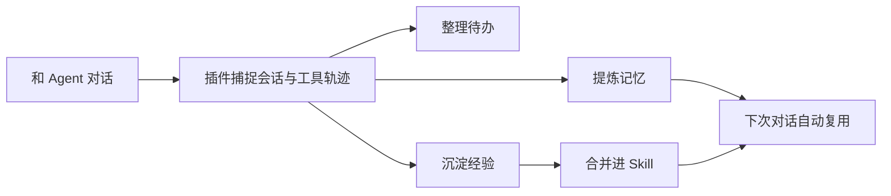

# Agentmemory 项目介绍：本地 Agent 记忆工作台

> 一句话：Agentmemory 把 Coding Agent 的会话、工具调用、偏好、经验、Skill 和待办整理成一个可审阅、可更新、可复用的本地记忆层。

## 0. 先看这一页

| 结论卡 | 内容 |
| --- | --- |
| 定位 | 给 Codex / Claude Code / Cursor / Gemini CLI 等 Agent 使用的本地记忆工作台 |
| 核心价值 | 减少重复解释，让 Agent 记住项目背景、用户偏好、工作进展和可复用经验 |
| 产品形态 | 本地服务 + Viewer + 插件 / MCP / Hooks |
| 默认工作流 | 对话自动记录，记忆自动提炼，用户负责审阅、编辑和删除 |
| 适合人群 | 长期使用 Coding Agent 的开发者、产品设计者、AI 工作流研究者 |
| 当前重点 | 优化 Viewer 的可理解性：记忆、会话、Skill、待办都要能被普通用户看懂 |

## 1. 项目截图

下方图片建议在飞书中作为真实图片块插入：

- `assets/banner.png`：项目主视觉
- `assets/demo.gif`：产品演示动图
- `website/public/dashboard.png`：总览页
- `website/public/states.png`：状态 / 待办相关界面

## 2. 产品地图

| 模块 | 用户看到什么 | 背后解决什么问题 |
| --- | --- | --- |
| 总览 | 最近会话、记忆数量、经验数量、状态 | 快速判断记忆系统是否在工作 |
| 记忆 | 身份档案、偏好、项目目标、经历 | 把聊天记录提炼成可审阅的长期记忆 |
| 会话 | 按项目组织的完整历史会话 | 回看 Agent 到底做过什么，而不是只看摘要 |
| Skill | 本地 Skill 清单、路径、说明、内容预览 | 管理本机 Agent 能力，沉淀可复用经验 |
| 待办 | 待跟进、正在做、卡住了、已完成 | 从会话自动整理下一步行动 |
| 活动 | 近期工具调用和工作轨迹 | 保留 Agent 行为证据链 |

## 3. 为什么需要它

| 痛点 | 用户语言 | Agentmemory 的回应 |
| --- | --- | --- |
| 每次都要解释项目背景 | “我不是上次说过了吗？” | 会话和项目上下文自动保存 |
| Agent 记不住偏好 | “我喜欢先看图，不想先听技术细节。” | 稳定偏好进入记忆库 |
| 历史会话不可复盘 | “我想知道最近到底做了什么。” | 会话页保留完整过程和记录 |
| 经验沉淀不连续 | “这些可沉淀经验你要时常更新啊。” | 从工作中主动写入经验库 |
| Skill 越装越乱 | “本地 Skill 能不能完整管理？” | Skill 页展示来源、路径和内容预览 |
| 待办页像数据库 | “看不懂啊。” | 改成自然语言分组和卡片化待办 |

## 4. 推荐工作流

| 阶段 | 发生什么 | 用户控制点 |
| --- | --- | --- |
| 1. 对话 | 用户正常和 Agent 协作 | 不需要额外记笔记 |
| 2. 捕捉 | 插件 / hooks 记录会话、工具调用、任务结果 | 可查看原始会话 |
| 3. 提炼 | 系统提炼记忆、经验、待办 | 用户审阅、编辑、删除 |
| 4. 复用 | 下一次对话自动带入相关上下文 | 用户可以修正记忆 |
| 5. Skill 化 | 成熟经验写入本地 Skill | 用户管理 Skill 文件 |



## 5. 插件与集成

Agentmemory 的关键不只是 Viewer，而是插件接入。插件让记忆在日常工作中自然生成。

| 接入方式 | 适合场景 | 能力 |
| --- | --- | --- |
| Codex 插件 | Codex CLI / Codex Desktop | MCP、hooks、skills、会话捕捉 |
| Claude Code 插件 | Claude Code 项目开发 | hooks、MCP、记忆注入 |
| OpenCode 插件 | OpenCode 用户 | commands、capture plugin |
| MCP Server | Cursor、Gemini CLI、Claude Desktop | 通过 MCP 调用记忆工具 |
| REST API | 自定义 Agent / 本地工具 | 直接读写记忆和会话数据 |

## 6. 当前 Viewer 设计原则

| 原则 | 说明 |
| --- | --- |
| 少露出内部概念 | 隐藏 profile / graph / audit / replay 等难懂入口 |
| 能点击就下钻 | 总览卡片要能跳到对应会话或详情 |
| 自动优先，手动补漏 | 记忆应基于聊天自动更新，手动添加只是例外 |
| 可审阅可修正 | 用户必须能编辑、删除和理解记忆来源 |
| Skill 是资产 | Skill 不只是标签，要能查看路径、说明和内容 |
| 待办说人话 | 不直接暴露 priority / frontier / status table |

## 7. 快速启动

```bash
npm install -g @agentmemory/agentmemory
agentmemory
```

打开：

```text
http://localhost:3113/#dashboard
```

连接 Agent：

```bash
agentmemory connect codex
agentmemory connect claude-code
agentmemory connect cursor
agentmemory connect gemini-cli
```

## 8. 下一步建议

| 优先级 | 方向 | 为什么 |
| --- | --- | --- |
| P0 | 插件状态页 | 让用户知道插件是否真的在工作 |
| P0 | 自动记忆策略 | 完成会话后主动写入记忆、经验和待办 |
| P1 | Skill 经验合并 | 从“可沉淀经验”一键生成 / 追加到 SKILL.md |
| P1 | 重复 Skill 检测 | 管理本地 Skill 资产，减少混乱 |
| P2 | 关系图重做或移除 | 当前关系图不够可见，不应占主要入口 |

## 9. 一句话判断

Agentmemory 的方向不是“更多记录”，而是“让 Agent 的工作记忆变得可见、可控、可复用”。

